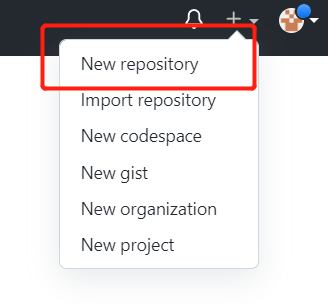
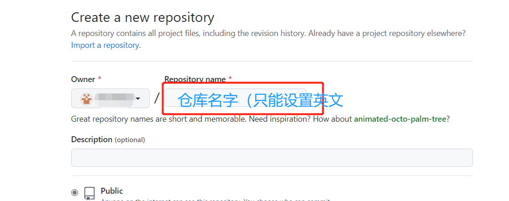
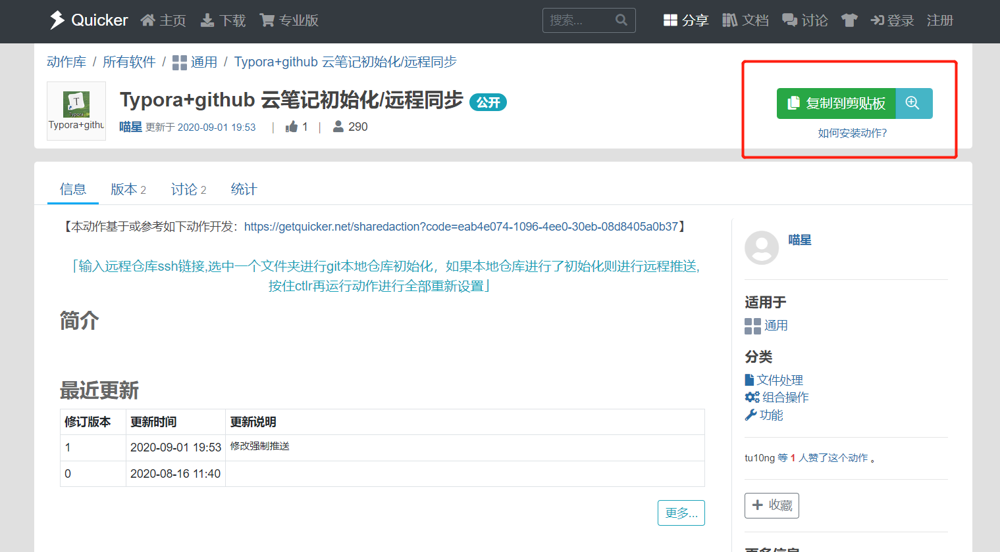
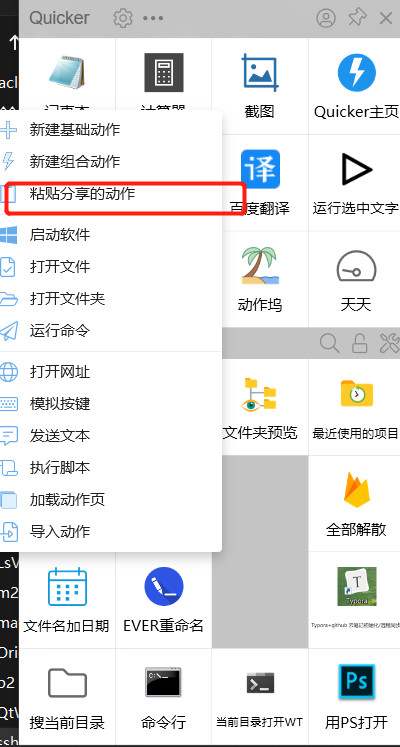
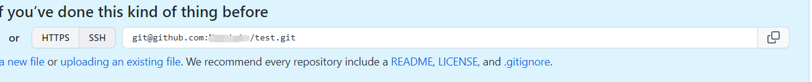

# git实现笔记自动上传功能


### 简介：

> 将更新内容自动上传同步git，无需手动提交，解锁一键式同步。流程大致为，创建新仓库，配置公钥和私钥，安装quicker软件，通过quicker上某脚本完成一键提交。

### 教程：

> 这里使用的是window系统，远程仓库使用的是github

假如是初次使用git的同学看这里，这里会教，配置过git的同学直接跳到第一步

#### 如何配置git

##### 第一步）配置用户名和邮箱

初次安装git需要配置用户名和邮箱，在电脑上运行Git Bash


运行命令

```bash
$ git config --global user.name "你自己的用户名"
$ git config --global user.email "你自己的邮箱"
```

这里的用户名和邮箱是git提交时用来显示你身份和联系方式的，并不是github用户名和邮箱

##### 第二步）配置自己的SSH密钥

简单说一下什么是ssh密钥，ssh密钥分为公钥和私钥，每个用户都必须提供一个公钥用于授权，当该用户发送文件时，用私钥签名，而别人就需要他给的公钥解密。

初次使用的同学都要生成自己的钥匙，并添加到自己的github上

同样是打开GitBash，使用指令

```bash
$ ssh-keygen -t rsa -C {你的邮箱} -f ~/.ssh/test{备注：此处test为本地密钥(文件)的名字}
```

可以打开C盘目录->User(用户)->XXX->.ssh文件里面查看，pub后缀的就是公钥，没有则为私钥

打开pub文件，可用文本工具打开，全选复制我们刚刚生成的密钥。

打开Github，找到setting，找到SSH设置选项，新建，粘贴，起名，确定。

#### 一、创建github远程仓库





其他统一不需要勾选直接创建就可以了。创建成功后找到仓库对应的SSH地址，这里的SSH可以理解为仓库的地址或者是仓库的锁，用这个地址或者这把锁就可以在我们自己的计算机上找到这个地址或者这把锁了。

#### 二、连接远程仓库

##### 第一步）提前安装好Quicker

这里直接打开或者先下载安装[Quicker](https://getquicker.net/Download)

##### 第二步）下载<Typora+github 云笔记初始化/远程同步>动作

在动作库里面下载**<Typora+github 云笔记初始化/远程同步>**这个动作，或者可以打开这条[直接下载](https://getquicker.net/Sharedaction?code=bf3da905-e641-4bc8-668d-08d841787f87&fromMyShare=true)，完事之后复制到剪贴板



##### 第三步）在文件夹界面新建动作

在文件夹下，中键打开Quicker小界面，右击粘贴分享的动作



##### 第四步）给动作配置远程仓库的SSH

还记得我们远程仓库的SSH吗？复制远程仓库的SSH



然后在我们存储笔记本的文件夹**中键**快捷打开Quicker，按住**Ctrl**单击输入我们的SSH地址，这样这个文件夹就自动和远程仓库同步了。

接下来就可以开心的一键上传笔记到Github上了。

以后写完笔记，中键执行动作完成所有操作，类似其他的git仓库也可以使用。

