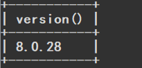
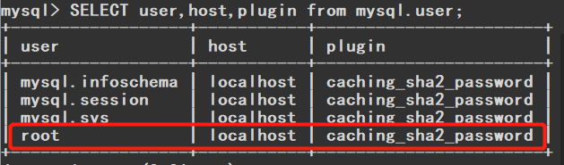
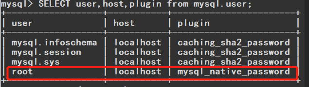

# 前端错题本

# Nodejs遇到的问题

1. 在请求ajax中，所有的属性都要小写，大写会无效的。

2. 使用express和CORS中间件做跨域解决时，设置CORS中间件必须要在跨域路由之前。

3. MySQL数据库因版本导致的加密规则不同，[mysql8](https://so.csdn.net/so/search?q=mysql8&spm=1001.2101.3001.7020) 之前的版本中加密规则是mysql_native_password,而在mysql8之后,加密规则是caching_sha2_password

   报错信息`Client does not support authentication protocol requested by server; consider upgrading MySQL client`可以考虑通过修改加密规则
   
   I. 打开cmd窗口，登录mysql;
   
   `mysql -u root -h 127.0.0.1 -P3306 -p `
   
   `-u `后面 root 为自己数据库的用户名
   
   `-h` 后面为 (mysql服务所在地址)，我自己是在本机测试，所以为127.0.0.1
   
   `-P` (可选,默认3306 指定端口号)
   -可以看到自己的mysql版本-
   
   
   
   II. 查看现有的用户
   `SELECT user,host,plugin from mysql.user;`
   
   
   
   我的用户名是root，可以看到加密规则是`caching_sha2_password`
   
   III. 重新设置加密方式
   
   `ALTER USER '自己的用户名'@'localhost' IDENTIFIED WITH mysql_native_password BY '自己的密码';`
   
   修改加密规则为`mysql_native_password`
   
   IV. 设置更新生效
   
   `FLUSH PRIVILEGES;`
   
   V. 查看设置是否成功
   
   `SELECT user,host,plugin from mysql.user;`
   
   

4. 发现页面一直加载不出，很有可能是app.js上使用的全局中间件忘了写`next()`

5. 写接口时报错` Cannot set headers after they are sent to the clien.`原因：客户端发出一次请求，服务器给出两次及以上响应。解决方案：清理多余的响应，检查每次响应后是否return

6. req.auth/req.user取不到值。解决方法：不用user老写法，现在都是用auth。req.auth还取不到的话，查看一下express-jwt中间件配了没，将顺序排放在路由挂载前面。

# vue遇到的问题

1. 遇到html引入js文件失败，`<script src="src/index.js></script>"`，改为`<script type="module" src="src/index.js></script>"`

2. 使用单文件组件vue时需要先安装@vitejs/plugin-vue，且配置好vite.config.js文件

3. 遇到template下的标签报红波浪线，大概率是没有用一个大的元素抱起来，根组件下vue的规范是只有一个element

4. 使用yarn自动创建项目报错

   ```shell
   PS D:\CPJ\Vue3Learning\vue3构建工具\02使用vite> yarn create vue
   [1/4] Resolving packages...
   [2/4] Fetching packages...
   [3/4] Linking dependencies...
   
   success Installed "create-vue@3.6.1" with binaries:
         - create-vue
   [##] 2/2文件名、目录名或卷标语法不正确。
   error Command failed.
   Exit code: 1
   Command: D:\Environmentwarehouse\nodejs\npm_global_modules\bin\create-vue
   Arguments: 
   Directory: D:\CPJ\Vue3Learning\vue3构建工具\02使用vite
   Output:
   ```

   解决方法：将全局文件夹和缓冲文件夹设置在同一目录下即可

   ```shell
   yarn config set global-folder "D:\yarn\global"
   yarn config set cache-folder "D:\yarn\cache"
   ```

5. 使用template: ``时候，需要在main.js（挂载的组件）中将createVue的导入方式改为

   ```js
   import {createApp} from "vue/dist/vue.esm-bundler.js"
   ```

   否则会出现警告，且无法使用

   ```
   [Vue warn]: Component provided template option but runtime compilation is not supported in this build of Vue. Configure your bundler to alias "vue" to "vue/dist/vue.esm-bundler.js". 
     at <Anonymous post-title="hellow!" > 
     at <App>
   ```

6. 在vue中使用模板一般是使用*camelCase*，但是html中会将所有标签中的大写解析为小写，所以一般是使用*kebab-case*，页面不显示模板时可以排查一下。💨不过setup就不会出现这种问题，大写小写横线都可以

   ```js
   // JavaScript 中的 camelCase
   const BlogPost = {
     props: ['postTitle'],
     emits: ['updatePost'],
     template: `
       <h3>{{ postTitle }}</h3>
     `
   }
   ```

   ```html
   <!-- HTML 中的 kebab-case -->
   <blog-post post-title="hello!" @update-post="onUpdatePost"></blog-post>
   ```

7. 计算属性只能计算一些简单数值，太复杂的类似遍历数组累加的用method快多了。

8. 出现`[Vue warn]: Maximum recursive updates exceeded in component <ElTableColumn>` 可以看下是不是 `computed` 或者 `method` 被多次调用了，使用一个变量接收再赋值即可。

9. 响应式数据和样式绑定可以通过字符串拼接，再通过模板覆盖标签 `style` 属性

10. 多写注释！！！！

11. 使用vue-cli还是vite，小项目+新项目使用vite；大型项目+老项目+原用cli的使用vue-cli

12. 先加的样式不会被后加的样式覆盖，例如：.a类被使用，想改成.a .active，a里面使用的属性不会被覆盖掉，所以再绑定这个class加相同的样式就不会生效了！只能是重新写一个新的类去更改其属性，没办法做到覆盖。TODO解决方法还为找到！！

13. 使用vue-router中的路由别名时，取别名的路径不能和排在前面的路径撞，不然无法生效。解决方法：调整一下顺序。

14.  `defineProps` 对象获取不到数据，很有可能是路径所对应的路由表的props属性没有设置为true：`props: true`.


