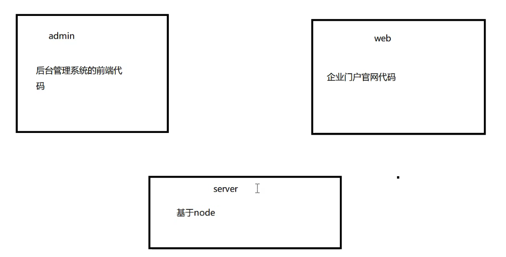

# 项目

### 1 - 新闻管理发布项目

[千峰教育Nodejs+Vue](https://www.bilibili.com/video/BV11s4y1a71T)

脚手架： 推荐vue-cli v5.0.1 实际使用：vue-cli v5.0.8

前端 Vue框架 实际使用：Vue v3.2.47

后端 Nodejs


> 使用vuecli和vite区别是，vite会比vuecli更简洁很多，但是很多设置需要自己去补上，例如是否使用router，vuex，使用预处理器less/scss，配置文件全部放一起还是分开都很细。

### Day1

1. 划分用户和模块



​	先写admin   `yarn serve`

2. 分配好路由：最大的两个路由（视图） - Login和MainBox

   规划好页面布局的结构

3. 划分路由时，提出MainBox使用动态路由，管理页面不是人人都有MainBox下面的子路由使用一个单独的js文件导出，避免index.js代码冗长

4. views文件 router文件划分好了模块 views：产品-用户-新闻 管理  center home  统一划分到路由表下

5. 规定导航守卫判断login状态，是否放行MainBox，查看localStorage是否有token

6. 第一个坎，登录判断+动态路由需要使用vuex进行状态管理

   假如直接动态添加路由，会在第一次进入页面时正常添加，第二次（刷新页面）会导致路由重复添加出现 `warning` 

   所以需要将**第一次**和**后续**区别开进入做分支，使用vuex对状态进行判断

7. 运行客户端`yarn serve`

**总结**：划分页面结构，配置路由，文件夹划分，子路由的规定，动态添加子路由，使用vuex对应用程序状态管理。

**难题**：文件的划分很难记；导航守卫的定义使用放行和重定向；

### Day2

1. notfound页面，测试未注册的路由时会出现not match的warning

2.  elementplus安装和引入

3. 全局引入 - 在main.js中引入js和css文件

   ```js
   // import "element-plus";
   // import "element-plus/dist/index.css";
   ```

4. 实际使用**局部引入**elementplus - 在NotFound.vue中引入

   ```html
   <template>
       <el-empty description="404"></el-empty>
   </template>
   
   <script setup>
   	import {ElEmpty} from "element-plus";
   	import "element-plus/dist/index.css";
   </script>
   ```

   事实上更多会使用**按需引入**，

5. 使用particles.vue插件渲染登录背景

6. particles插件走了很多坑，

   第一个是无法局部引入，

   第二个在全局引入之后出现蓝屏的效果，这是因为没有定义`particlesInit`方法

   ```js
   // yarn add tsparticles
   import { loadFull } from "tsparticles";
   
   // 设置particle中的particlesInit
   const particlesInit = async (engine) => {
     await loadFull(engine);
   };
   ```

   第三个是载入插件后没有销毁，会导致内存泄漏。[在vue3中使用 VueParticles (粒子动态背景) - 掘金 (juejin.cn)](https://juejin.cn/post/7088263584731365413)

7. 将particles的option提出，修改particles颜色

8. elementplus表单cv

9. 表单引用对象绑定，响应式数据绑定，规则定义，登录方法绑定

10. 规则绑定时定义的rules是绑定在表单上，而表单下的属性username和password需要通过input标签上的 `prop` 来与表单关联。a. `form ->  v-model`   b.  `rules.props -> form rules -> form>input>prop` 

11. 样式模块化 ，深层，::v-deep  elementplus的选择器

**总结**：particles插件使用，elementplus组件框架使用，前俩需要看官方文档看懂，vue语法糖引入组件

**难点**：particles难用，粒子清除还不会。elementplus样式修改需要对css很通透，scss的使用。语法糖的写法网上很少。

**改进**：减少组件上花费的时间，particle组件浪费很多时间在新版本使用和粒子清除（未解决）。花费很多时间去解决一个`动态载入路由从而匹配不到路由warning的一个小bug`

### Day3

1. 登录跳转
2. MainBox布局使用elementplus
3. 左侧边栏 ep cv +icon 
4. 添加侧边栏收缩
5. 侧边栏`<router-view></router-view>`实现子路由的跳转 看ep文档 在第3点需要提前设置好 `index` 属性
6. 侧边栏刷新页面后高亮设置 ep文档
7. topheader布局
8. topheader ep cv +icon
9. 绑定topheader的个人中心跳转和退出删除token

**总结**：使用element-plus提供的组件真的很容易很方便

### Day4

1. 用express创建服务端服务器  
2. 导入依赖，划分模块
3. app<- index、user
4. 客户端导入axios库做请求
5. 使用vuecli脚手架提供的反向代理解决跨域，在vue.config.js
6. 服务端模块划分：routes，controllers，service，models(mongo模型)，db，bin，config
7. 以上分别存放：路由表->controller、controller调用多个service服务、service数据处理逻辑->models、models存放对象模型 规定schema、db在上一级目录存放数据、config配置连接mongo数据库
8. mongo的使用，models  schema  config  GUI界面
9. 运行服务端 `nodemon ./app.js`

难点：mangodb安装，引入，配置，model对象创建，schema定义，service层使用model对象，千峰node有讲mongo可以看。vuecli的跨域处理也不会，vue.config.js配置文件的路由名，指向都不懂搞好久，`changeOrigin: true`,

！！！`express 解析 ajax post 数据 body 为空对象`  - [express 解析 ajax post 数据 body 为空对象](https://blog.csdn.net/qq_42535651/article/details/111186793) 在**服务端配置**bodyParser中间件，设置app.use(bodyParser.json())，成功解析！


## 2 - 网易云音乐前端项目

使用网易云的接口，用vue框架搭建前端项目

使用vue-cli  less  vuex vuerouter  vue3 使用历史模式  使用package.json的形式  vant移动端组件库  使用babel插件实现按需引入


### Day1

1. github拉取接口服务器，npm install+npm app.js
2. vuecli创建项目，使用vue-cli  less  vuex vuerouter  vue3 使用历史模式  使用package.json的形式  `yarn serve`
3. 适配移动端 rem布局  （手动适配 ，以后可以用插件
4. rem的计算公式，rem和font-size的关系，documentElement和body的关系
5. 使用阿里巴巴图标库搜“就呆”
6. 划分视图模块
7. 引入图标，搭建主页头部导航栏组件
8. 引入vant组件库
9. 安装babel插件，配置babel插件
10. vant组件二次包装，插件形式使用在app上（全局注册）
11. topNav使用vant组件
12. 首页轮播图Swipe
13. 安装axios
14. onMounted->axios调用接口获取轮播图图片地址